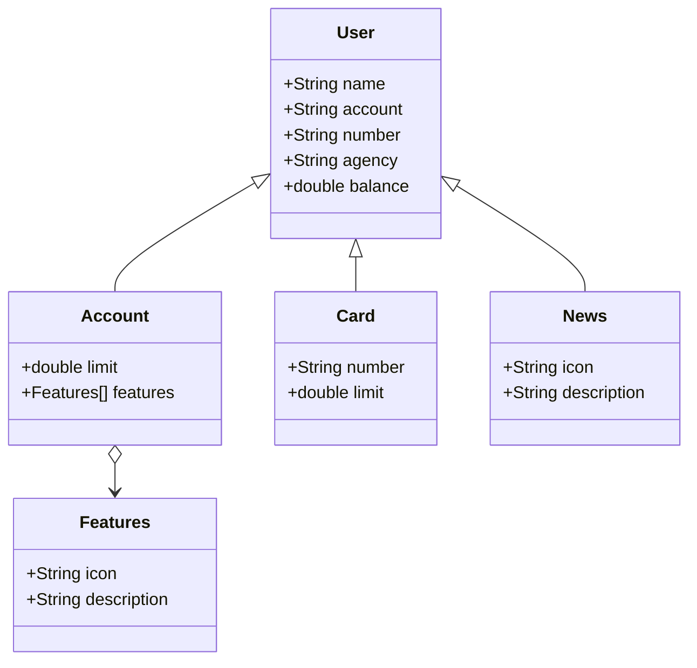

# Java API RESTful - Bootcamp Decola Tech da DIO

Bem-vindo ao projeto **Java API RESTful** desenvolvido como parte do Bootcamp Decola Tech da DIO (Digital Innovation One). Este projeto implementa uma API RESTful para gerenciar dados de usuários bancários, seguindo práticas modernas de Java e boas práticas para o desenvolvimento de APIs.

## Índice
- [Sobre o Projeto](#sobre-o-projeto)
- [Funcionalidades](#funcionalidades)
- [Tecnologias Utilizadas](#tecnologias-utilizadas)
- [Instalação](#instalação)
- [Uso](#uso)
- [Diagrama de Classes](#diagrama-de-classes)
- [Contribuindo](#contribuindo)
- [Licença](#licença)
- [Contato](#contato)

## Sobre o Projeto
Esta API fornece uma solução robusta para gerenciar informações de usuários bancários, incluindo contas, cartões e atualizações de notícias. Foi criada para demonstrar habilidades de desenvolvimento de APIs RESTful aprendidas durante o Bootcamp Decola Tech da DIO, com foco em código limpo, escalabilidade e manutenibilidade.

## Funcionalidades
- Gerenciamento de usuários (ex.: nome, detalhes da conta, saldo).
- Gerenciamento de contas com recursos e limites.
- Gerenciamento de cartões com números de cartão e limites.
- Atualizações de notícias para usuários.
- Endpoints RESTful para operações CRUD.

## Tecnologias Utilizadas
- **Java 17+**: Linguagem de programação principal.
- **Spring Boot**: Framework para construir a API RESTful.
- **Maven**: Ferramenta de gerenciamento de dependências e build.
- **PostgreSQL** (ou banco de dados em memória como H2 para testes): Gerenciamento de banco de dados.
- **Swagger/OpenAPI**: Documentação da API.
- **JUnit & Mockito**: Testes unitários e de integração.

## Instalação
1. Clone o repositório:
   ```bash
   git clone https://github.com/seu-usuario/java-restful-decola-tech.git
   ```
2. Navegue até o diretório do projeto:
   ```bash
   cd java-restful-decola-tech
   ```
3. Instale as dependências usando o Maven:
   ```bash
   mvn clean install
   ```
4. Configure as configurações do banco de dados em `src/main/resources/application.properties`.
5. Execute a aplicação:
   ```bash
   mvn spring-boot:run
   ```

## Uso
A API é acessível por meio de métodos HTTP padrão (GET, POST, PUT, DELETE). Use ferramentas como Postman ou Swagger UI (disponível em `/swagger-ui.html` após executar o app) para interagir com os endpoints.

Exemplo de endpoint:
- **GET /api/users/{id}**: Recupera os detalhes de um usuário pelo ID.

Consulte a documentação do Swagger para uma lista completa de endpoints e suas especificações.

## Diagrama de Classes
Abaixo está um diagrama de classes simplificado representando as entidades principais da API, gerado usando Mermaid:



Para renderizar este diagrama no GitHub, certifique-se de que o suporte ao Mermaid esteja ativado ou visualize-o em um ambiente que suporte Mermaid (por exemplo, GitHub Actions ou um visualizador Markdown local com integração Mermaid).

## Contribuindo
Contribuições são bem-vindas! Siga estes passos:
1. Faça um fork do repositório.
2. Crie um novo branch (`git checkout -b feature/sua-funcionalidade`).
3. Faça suas alterações e committe-as (`git commit -m "Adicione sua mensagem"`).
4. Envie para o branch (`git push origin feature/sua-funcionalidade`).
5. Abra um Pull Request.

Por favor, siga o código de conduta do projeto e certifique-se de que seu código passa em todos os testes.
